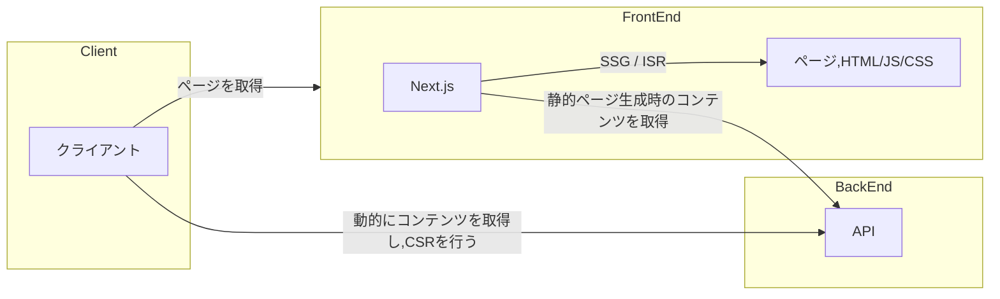
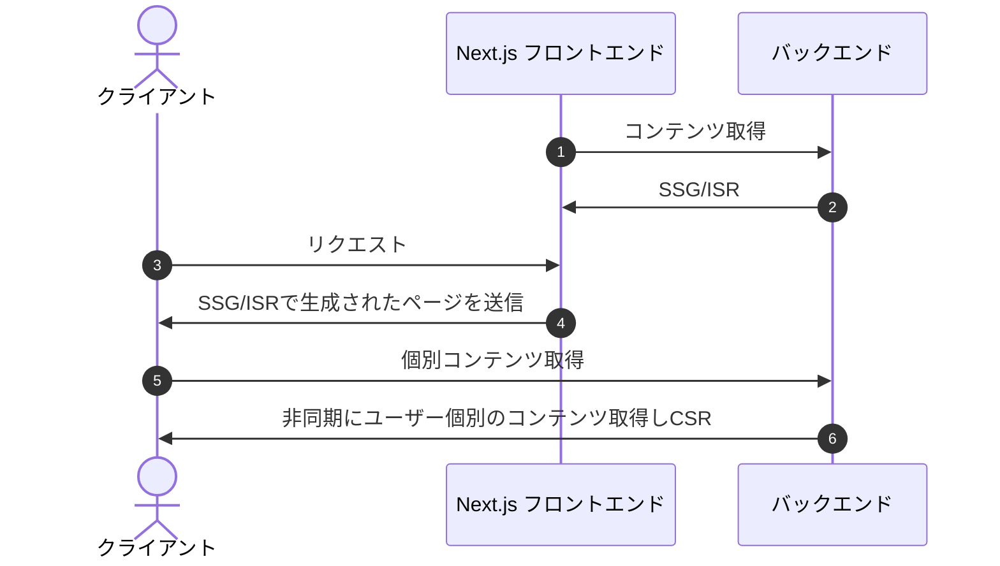

# アプリケーションのアーキテクチャ

基本的にはAPIからコンテンツを取得し、静的サイト生成（SSG）を行い、配信するページをあらかじめ生成する。 
必要に応じてインクリメンタル静的再生成（ISR）によってページを定期的に更新していく。
 
`ユーザー認証`を必要とするページなど、ユーザーごとに個別に表示するコンテンツが異なる場合はSSGで全て補うことはできない。この対策としてCSRも使用する。
 
静的コンテンツで配信できる部分はビルド時に生成（SSG）し、個別のコンテンツに関してはクライアントサイドからAPIを用いてページを表示（CSR）していく。

 
SSRのケースではユーザーの情報も含めてサーバーサイドで全ての処理を行い、完成されたHTMLを生成しレスポンスとして送信。 
 
一方でSSG/CSRのケースでは、あらかじめSSGでページをビルドしておき、クライアントサイドからのリクエストで全ユーザーに対して共通で使用する部分のみ入ったページをまずレスポンスとして送信する。その後CSRで各ユーザーに個別の内容を表示。
 
つまり、ビルド時に全コンテンツを乗せるのではなく、レスポンスがクライアントのブラウザへ返却された後でユーザー個別のコンテンツを非同期に取得し、レンダリングを行う。
 
SSRは一見シンプルだが、ユーザーごとにHTMLを生成する必要があり、大量のHTMLをキャッシュさせるのが難しいなど、ユーザー体験が損なわれがち。
 
対してSSG/CSRには、SSGで生成した部分（共通部分）はキャッシュさせて配信しつつ、必要な箇所だけCSRを用いてその場でレンダリング可能というメリットがある。
HTML等をCDNにキャッシュさせることでTTFB（Time To First Byte）が短縮されレイテンシが小さくなる。これによりページをより早く表示できユーザー体験が向上する。SSG+CSRは一見するとSPAと似たような構造に見える。しかし、初期表示においてゼロからHTMLを構築していくSPAとは違い、SSG+CSRではすでに共通部分がHTMLとして構築されているので初期表示のコストを抑えることができる。